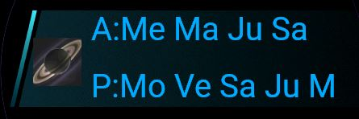
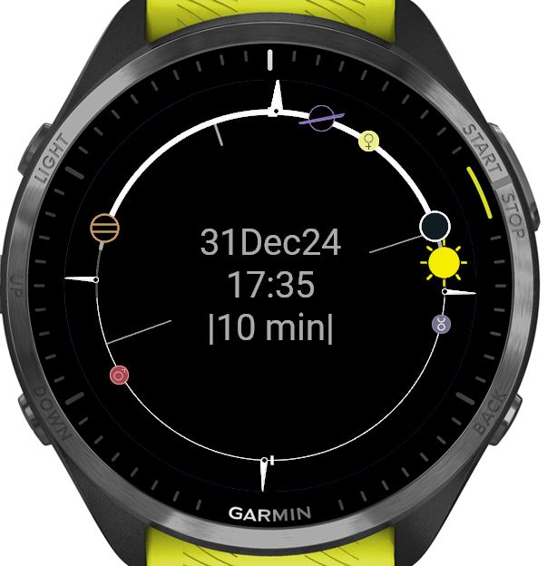

THE PLANETS is planetarium Glance & Widget for your Garmin smart watch. It shows positions of sun & planets in the sky currently & moving forward/backward by minutes, hours, days, years, or many years. Includes sun & moon and all naked-eye planets plus (optionally) Uranus, Neptune, Pluto & Ceres.

It's a planetarium & naked-eye/binocular astronomy viewing guide on your wrist: What is up tonight or right now? at a glance.

Additional markings on the Widget Solar Clock view show sunrise, sunset, moon phase, season - solstice, equinox - as seen from your location today and tonight, all viewable at a glance.  

This is the glance/widget version of The Planets.

**BUTTONS**
 * _BACK_ moves to 2nd screen (time increment 24 hrs) and then _EXITS_
 * _START_ starts & stops time
 * _UP/DOWN_ move time forward/backward OR, if time is _STARTED_, makes time move faster/slower
 * _MENU_ allows you to change several options & see help/planet abbreviations, including: Show more or fewer planets, make planet size larger or smaller, show planet labels or not, view help tips & planet abbreviations.
 * _TO EXIT_: Press BACK 2X.

**HOW THE GLANCE WORKS**
 - Glance shows a two-line summary of which planets are up in the evening (P:) and the morning (A:).  Something like this:
   
     
   
    - That means: In the morning, just before dawn, Mercury, Mars, Jupiter, and Saturn will be up (planets in order closest to the Sun to furthest).
    - In the evening, just after sunset, the Moon, Venus, Saturn, Jupiter, and Mars will be out. Again, planets are in order from  the one closest to the sun to furthest. In this situation, at sunset the Moon, Venus, and Saturn, are in the west near the sunset, Jupiter has just risen in the east, and Mars will rise in the east in a couple of hours.
   - If you want the exact details of where the planets are & when the will rise, tap Select or Start to move on to the widget, which will show a graphical representation of exactly where all the planets are now and will be in the morning or any other future time.

**HOW THE WIDGET WORKS**   
 - The Widget shows the ecliptic with all the visible planets (or some additional planets, including Neptune, Uranus, Pluto & Ceres) as a solar clock. You can instantly see which planets are up now, and then UP/DOWN/START to move time ahead or back and see what will be up later tonight or in the morning.  Or next week, next month, next year, next century, or millenium.   

   

Watch tonight's sky, or the outer Solar System over the next 4000 years, unfold in beautiful animations and graphics.

The planetary motion model is based on algorithms from the sophisticated VSOP model of planetary motion for very good accuracy for visual and general observation purposes for hundreds and thousands of years into the past and future. You can view solar system, planet, and dwarf planet, positions with very good accuracy for +/- 4000 years and with reasonable, though not perfect, accuracy through tens of thousands of years into the future or past.

**USAGE AND TIPS**
*Planet abbreviations:*
 * Sun
 * Me Mercury
 * Ve Venus
 * Ea Earth
 * Mo Moon
 * Ma Mars
 * Ju Jupiter
 * Sa Saturn     
 * Ur Uranus 
 * Ne Neptune     
 * Pl Pluto
 * Ce Ceres

_Tips About Screens & General Usage_

 * TIP: If you want to quick reset the time to the present, just exit the Widget (press BACK twice) and the re-start it.
   
 * TIP: Top-bottom of Large Circle are Solar Noon Midnight (marks). 

 * TIP: Horizontal moving marks are the HORIZON - anything above them is visible in the sky at that moment. Moving upper mark is the MERIDIAN, highest point of the ecliptic at your location right now. 

 * TIP: The Large Circle represents the ECLIPTIC, the apparent path of the Sun & Planets across the sky.

 * TIP: Planet positions are accurate to 1.2 deg for the period 2000BC to 6000 AD.

_Widget Usage Tips - What you need to know to make it work_

 * WIDGET TIP: START (SELECT or TAP SCREEN, depending on your watch) will start or stop time.

 * If time is _stopped_, UP/DOWN or SWIPE moves time forward or back by the interval shown on the screen

 * If time is _moving_, UP/DOWN or SWIPE speeds up or slows down the time interval.

 * The first screen in the Widget comes up at your current time & place.  Press UP/DOWN/START to explore the planets later tonight or for the next few days (or few previous days).
 * Move to the second screen of the widget by pressing BACK.
 * Exit the Widget by pressing BACK twice.
 * The second screen is set up to move time forward or by BY DAY.  Press START or use UP/DOWN to move time forward for the next several days or months.
 * TIP: The Solar Clock can run forward or backwards tens, hundreds, and even thousands of years.  Set a time increment of weeks or months and watch how the Sun, sunrise/sunset/dawn/dusk marks, horizon, Solstice & Equinox marks (indicating seasons) all move over longer time spans.

 * TIP: Just opening the app gives a quick view of what's up tonight/right now. 

 * TIP: Search for new moon, full moon, planetary conjunctions, etc.
   
 If you want to explore in more detail, install THE PLANETS app.  The Widget version is very constrained by memory requirements, and has only a few options and views.

**APP TECHNICAL DETAILS**

Using the [Greg Miller's VSOP Pico algorithm](https://github.com/gmiller123456/vsop87-multilang/blob/master/Languages/JavaScript/vsop87a_pico.js) gives [nearly all planetary positions 4000BC-6000AD within 1.2 degrees of actual position](https://celestialprogramming.com/vsop87-multilang/index.html) (and accuracy is far better 2125 +/-100 years).  Moving to the Nano algorithm was attempted and would improve accuracy by about 3X but takes a large amount of memory and runs far slower on today's smartwatches - perhaps in a future version!

Monkey C for Garmin IQ watches.

**CREDITS & LICENSE:**

_****** Planetary, sun, and moon positions and sunrise/sunset/dawn/dusk calculations:_  
 * [Greg Miller's version of the VSOP Pico algorithm for planetary, sun, and earth positions](https://github.com/gmiller123456/vsop87-multilang/blob/master/Languages/JavaScript/vsop87a_pico.js)
 * [Moon Position, also from Greg Miller](https://www.celestialprogramming.com/lowprecisionmoonposition.html)
   *  Note that this "low precision" algorithm gives positions within 0.5 degrees of the "high precision" algorithms for roughly +/- 4000 yrs from the present, and is many, many times faster and smaller to run - thus practical to run on the watch
 * Sunrise, sunset, dawn & dusk calculations also based on [algorithms from Greg Miller](https://www.celestialprogramming.com/riseandsetgraph/index.html)

 ** LICENSE of Miller's algorithms: PUBLIC DOMAIN
 Earlier version of the software used versions of code developed by [Ioannis Nasios](https://github.com/IoannisNasios/solarsystem) - that is all working/running code in Monkey C now and is found in directory /old-library-unused as it is not used in the current project.  However, that code could be adapted and used for other Garmin watch projects if desired.

 _******* Logo Image:_ Backlight Saturn, [PIA08329: In Saturn's Shadow](https://photojournal.jpl.nasa.gov/catalog/PIA08329) Cassini Mission, credit NASA.

_SOFTWARE LICENSE_
 * Portions due to Greg Miller's implementation of the VSOP algorithm, Moon algorithm, and sunrise/sunset algorithms are Public Domain.
 * Remainder Copyright 2024 Brent Hugh.

